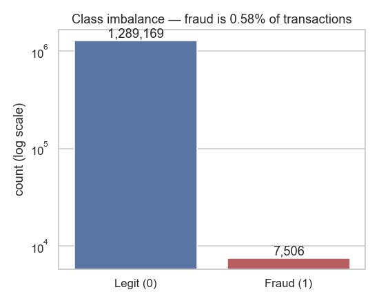
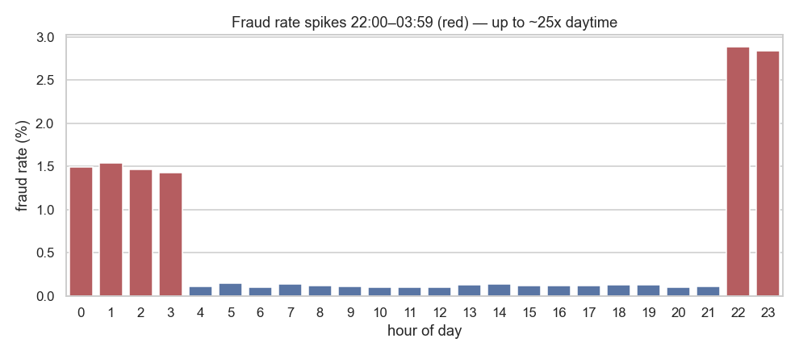
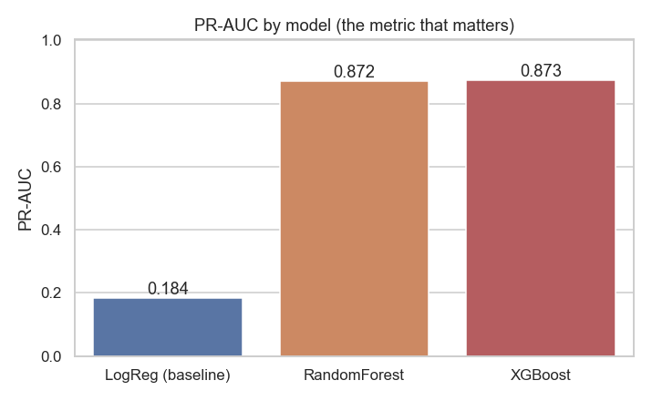
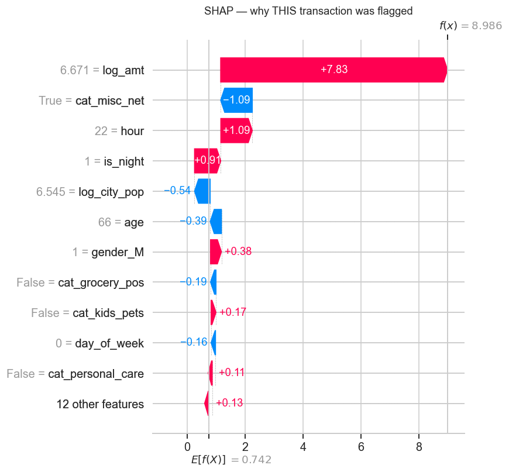

# 💳 Credit Card Fraud Detection

Detecting fraudulent card transactions on a **highly imbalanced** dataset (only **0.58%** fraud), where accuracy is meaningless and the real goal is **catching fraud (recall) without drowning analysts in false alarms (precision)**.

> Part of [**Machine-Learning**](../) · by **Muhammad Tahir Riaz**

📄 **[Full written report (with charts) →](reports/Credit_Card_Fraud_Detection_Report.docx)**

---

## 🎯 Headline result

| | Logistic Regression (baseline) | **Tuned XGBoost** |
|---|---|---|
| PR-AUC | 0.184 | **0.880** |
| Recall @ business threshold | 58% | **90%** |
| False alarms on legit traffic | — | **0.35%** |

**Business impact:** per 10,000 frauds, the model catches **~9,000 vs ~5,840** for the baseline — a **~75% cut in missed fraud** — while flagging only 0.35% of legitimate transactions for review.

---

## 📊 The story in four charts

| Class imbalance | Fraud by hour |
|---|---|
|  |  |
| **Model comparison (PR-AUC)** | **Why a transaction is flagged (SHAP)** |
|  |  |

---

## 🔑 Key findings

- **Amount** is the strongest signal — fraud averages **$531** vs **$68** for legit transactions.
- **Time of day** matters enormously — fraud spikes **22:00–03:59**, up to **~25× daytime rates**.
- **Online categories** (`shopping_net`, `misc_net`) carry the highest fraud rates.
- **Geo-distance is *not* predictive** here — both classes average ~76 km from home. Verified on the data rather than assumed (a common heuristic that fails on this simulated dataset).
- **SHAP confirms the EDA**: `log_amt` and `is_night` are the top model drivers.

---

## 🧭 Approach

```
EDA → Feature Engineering → Model Comparison → Tuning → SHAP → Business Threshold
```

1. **EDA** — quantify imbalance and the real fraud signals.
2. **Feature engineering** — amount, time-of-day, calendar, demographics, category. PII/identifiers and leakage columns dropped.
3. **Model ladder** — Logistic Regression → Random Forest → XGBoost, all evaluated on the **same held-out test file** with PR-AUC / recall / precision.
4. **Tuning** — PR-AUC-scored `RandomizedSearchCV` for XGBoost.
5. **Explainability** — SHAP global (beeswarm) + local (waterfall).
6. **Business threshold** — tuned to a **90% recall** policy, with the operational trade-off quantified.

---

## 📁 Structure

```
Credit-Card-Fraud-Detection/
├── notebooks/
│   ├── 01_eda.ipynb                  # EDA + figures
│   ├── 02_features_and_baseline.ipynb
│   ├── 03_model_comparison.ipynb     # LogReg vs RF vs XGBoost
│   └── 04_tuning_shap_threshold.ipynb
├── src/
│   ├── features.py                   # reusable, leak-safe feature pipeline
│   ├── profile_data.py               # quick data profiler
│   └── build_report.js               # generates the .docx report
├── reports/
│   ├── figures/                      # all charts (PNG)
│   ├── model_comparison.csv / .json
│   ├── threshold.json                # chosen operating threshold
│   └── Credit_Card_Fraud_Detection_Report.docx
└── requirements.txt
```

---

## ▶️ Reproduce

```bash
pip install -r requirements.txt

# Download the dataset (not committed — ~500 MB) and place the two CSVs in this folder:
#   Credit Card Train Data.csv  /  Credit Card Test Data.csv
# Source: Kaggle "Credit Card Transactions Fraud Detection Dataset" (Sparkov)

# Run notebooks in order, or execute headless:
jupyter nbconvert --to notebook --execute --inplace notebooks/01_eda.ipynb
```

> **Note:** the raw CSVs (351 MB + 150 MB) exceed GitHub's file limit and are git-ignored. Trained model binaries are regenerable by running the notebooks.

---

## 🛠️ Stack

`Python` · `pandas` · `scikit-learn` · `XGBoost` · `SHAP` · `imbalanced-learn` · `matplotlib` / `seaborn`
